# Allocation and Access Optimizations in a Component-Centric Entity Component System in C++

**Mattias E. O. Andersson** - 2014-05-15


## Abstract

- **Context:** An Entity Component System (ECS) is an architecture pattern most commonly used in games. An entity represents a discernible element within the game world and is made up of a combination of modular components that determines the entity’s overall behavior. ECSs can be further divided into Object-Centric and Component-Centric.

- **Objectives:** This study investigates optimization strategies in allocating and accessing components in a component-centric ECS and aims to provide a guideline to anyone interested in choosing from or implementing such a system. It also provides an overview of the history and terminology of ECS.

- **Methods:** A number of sources and articles on ECS are investigated. The object system of each ECS is broken down and into a series of data structures of increasing complexity and representative of the allocation and access pattern of each implementation. These are then compared with regards to allocation speed, access speed and memory consumption, using a basic array data structure as a baseline for comparison.

- **Results:** A number of data structures useful in an ECS are presented and the result of each data structure with regards to allocation and access are measured. Data structures using custom memory allocation proved to have a substantial improvement on allocation and deallocation performance. Only a moderate impact of access time was measured between the data structures of high-complexity, and data structures of low complexity.

**Keywords:** Games Architecture, Entity Component Systems, Software Performance

## Table of Content

  - [Introduction](#introduction)
    - [Topic](#topic)
      - [Object Systems](#object-systems)
      - [Entity Component Systems](#entity-component-systems)
      - [Object-Centric and Component-Centric Architectures](#object-centric-and-component-centric-architectures)
    - [Terminology](#terminology)
    - [Related Work](#related-work)
    - [Access Patterns](#access-patterns)
    - [Problem Formulation](#problem-formulation)
    - [Aim](#aim)
    - [Research Questions](#research-questions)
    - [Objectives](#objectives)
  - [Background](#background)
    - [Entities](#entities)
    - [Component-Based Object Systems](#component-based-object-systems)
    - [Container Data Structures](#container-data-structures)
    - [Memory Allocators](#memory-allocators)
    - [Memory Optimizations](#memory-optimizations)
    - [Memory Locality](#memory-locality)
    - [Instruction Cache](#instruction-cache)
    - [Data Hazards](#data-hazards)
    - [Data Alignment](#data-alignment)
  - [Method](#method)
  - [Implementations](#implementations)
    - [C++ Standard Library](#c-standard-library)
    - [Custom Data Structures](#custom-data-structures)
      - [ae::Array](#aearray)
      - [ae::StationaryArray](#aestationaryarray)
      - [ae::PoolArray](#aepoolarray)
      - [ae::PoolPtr](#aepoolptr)
      - [ae::IdPoolArray](#aeidpoolarray)
      - [ae::PoolList](#aepoollist)
    - [Note on Thread Safety](#note-on-thread-safety)
  - [Hardware](#hardware)
  - [Results](#results)
  - [Conclusions](#conclusions)
  - [Future Work](#future-work)
  - [Bibliography](#bibliography)
  - [Internet Links](#internet-links)


## Introduction

This study will analyse and compare some of the most common optimization strategies used in allocating and accessing components in a component-centric Entity Component System. The section starts by introducing the area and terminology of entity component systems. It also cover the objective of the study and what can be expected in later sections.

### Topic

Game engines, both available publicly or commercially, can vary greatly in details of their implementation. Some are tied to a specific game or game genre, while some strive to be generic, but even so, almost all share a set of recognizable subsystems usually operating within specific domains, such as rendering, audio, physics and AI [\[1\]](#b_1). This requires a mean of communication between the different systems, usually done in what has been referred by many authors as an Object System [\[2\]](#b_2)[\[3\]](#b_3)[\[4\]](#b_4).

#### Object Systems

The object system allows different systems to share data between each other in the form of Entities (sometimes referred to as Game Objects) which represent a discernible elements within the game world. An entity usually contains the properties required by one or more systems to operate, e.g. the position of an object, required in both a rendering system to know where to render an object and a physics system to move an object.

#### Entity Component Systems

An increasingly popular category of object system is a component based object systems, often referred to as an Entity Component System (ECS). It allows entities to be described as a set of modular components which collectively provide the overall behavior of the object. This offers flexibility as a wide range of entities with varying behavior can be created through combinations of reusable components.

Barring some variations in terminology, an ECS consists in some form or another of the following elements:

- **Entity**: General-purpose object, composed by a set of components. An entity by itself has no effect on the game world, it is simply a way to collect components.

- **Property**: Particular attribute (or property) of an element in the game world, e.g. position, rotation or health. The property could either be an atomic data type, such as a boolean, an integer or a floating point; or a more advanced type, such as an array, a 3D vector or a matrix [\[1\]](#b_1).

- **Component**: Container used to label a collection of properties and behaviors. The properties are usually stored inside the components themselves, but could also be stored separately and accessed as key-value pairs [\[5\]](#b_5)[\[2\]](#b_2). The behavior could also be provided by systems operating on the specific component or through scripting [\[1\]](#b_1).

- **System**: A system (or a subsystem) is a separate part of the architecture responsible for a specific domain, e.g. rendering, audio or physics. A system is interested in one or more types of components as they contain the data used by the system to operate.

#### Object-Centric and Component-Centric Architectures

An object systems usually ranges from one of two architectures [\[2\]](#b_2)[\[6\]](#b_6)[\[1\]](#b_1) (see [Figure 1.1](#fig_1_1) for a visual comparison):

<p id="fig" align="center">
  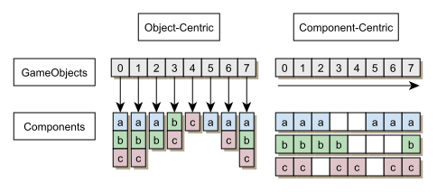
</p>

> <b>Figure 1.1:</b> Comparison of an Object-Centric (left) and a Component-Centric (right) object system.</p>


- **Object-Centric**: In an object-centric architecture the data and behavior relevant to the entity is encapsulated inside the entity in an object-oriented manner. The game world is generally updated by calling an update method on each entity. The entity may then proceed to either update itself or call and update method on each of its components which thereafter performs its behavior by calculating on its properties, accessing other components or by communicating with subsystems.

- **Component-Centric**: In a component-centric architecture the entity as a whole is seen and updated through its components. The components are usually stored in a separate data structure and keyed to the unique id of an object. A system interested in a particular type of component may then query the components directly without the indirection of the entity.

An object-centric architecture tend to be more intuitive than a component-centric design, as the representation of an object is encapsulated within the entity, which matches how an object is usually modelled in the game world. This also makes it easier to operate on the entity as a whole, such as inserting, copying or extracting entities from the game world [\[2\]](#b_2).

A component-centric architecture on the other hand is easier to optimize. One such optimization is to store components in separate data structures appropriate to the access pattern of each component type . This allows systems to more readily read and update components in batches which usually is far more efficient than updating each entity individually, in large data sets, as this allows better use of system resources, such as the CPU cache. Even object-centric architectures often try to mix in some form of batched updates in systems such as rendering and physics, as these types of systems generally have very stringent performance constrains [\[1\]](#b_1).

A visual overview of the area of component based object systems, as covered in this section, is seen in [Figure 1.2](#fig_1_2).

<p id="fig" align="center">
  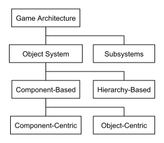
</p>

> <center><b>Figure 1.2:</b> Visual overview of component based object systems.</p></center>

### Terminology

There are some variations in terminology used by various authors to refer to a component based object system.

The term Entity System or Entity Component System was established fairly recently in 2007[<sup>4</sup>](#l_4) but has grown to become the most commonly used name to referred to the architecture.

It should be noted that there are some disagreement if object-centric object system, which is similar in design to the strategy pattern [\[12\]](#b_12), should be called an ECS or not, or if it should only apply to component-centric architectures. In this study we will make no such distinction as each architecture involves entities, components and systems, and instead refer to each ECS as being either object-centric or component-centric.

Some authors also use the term property-centric architecture instead of component-centric. As noted by Jason Gregory  [\[1\]](#b_1) in a property-centric design, each subobject defines a particular attribute of an entity, whereas a component in an object-centric design typically represents linkages to particular subsystems, but that the distinction is so subtle as to be irrelevant in most cases as both designs consists of a logical game object comprised of, and that derives its behavior from, a collection of subobjects.

### Related Work

First known instances of ECS was seen in 2002 [\[3\]](#b_3)[\[6\]](#b_6)[\[1\]](#b_2) and has since been used in a number of publications [\[7\]](#b_7)[\[8\]](#b_8)[\[9\]](#b_9), and by a number of game studios, including but not limited to Gas Powered Games [\[3\]](#b_3), Ion Storm [\[6\]](#b_6), Codemasters[<sup>1</sup>](#l_1), Neversoft[<sup>2</sup>](#l_2) and Radical Entertainment [\[5\]](#b_5). In addition to this, the game engine Unity[<sup>3</sup>](#l_3), which is used by a large number of developers today, can be considered as an ECS. Notably, the Unity game engine has a component-based game object architecture that according to Scott Bilas (now employed by Unity Technologies) was directly derived from his "A Data-Driven Game Object System" lecture from 2002 while employed at Gas Powered Games[<sup>8</sup>](#l_8).

As these implementations of ECSs has become well known, future game engines and game architectures are likely to take inspirations from them. Despite this, relatively little research into game engine architectures has been made. There are exceptions however.

Michael Doherty has proposed a high-level general software architecture for games, designed to maximize reusability in both single player and networked multiplayer [\[2\]](#b_2) inspired by ECSs as outlined by Scott Bilas [\[3\]](#b_3) and Alex Duran [\[10\]](#b_10). He also discusses several design options, and particularly addresses object-centric and component-centric architectures.

Lars Magnusson presents a component-centric ECS that attempts to completely separate dependencies in the object system from subsystems to create a genre independent game engine he refers to as a Game Mechanics Engine [\[11\]](#b_11). He also presents an extensive overview of various publications in game architecture.


### Access Patterns

Typically the following scenarios can be found in most games, which can be represented by a specific access or allocation pattern.

- **Sequential Access:** Entities are accessed sequentially, as part of updating a specific system, such as when a frame is rendered by the render system.

- **Random Access:** Entities are accessed randomly, as part of of game logic or interaction with other objects, such as collision detection.

- **Sequential Creation/Removal:** Entities are created and destroyed sequentially when a level loads during the start of the game, or when exiting a level.

- **Random Creation/Removal:** Entities are created and destroyed randomly as part of game logic.

In addition to this, different levels of indirection is used to access entities and components.

- **Direct Sequential Access:** Entities could be laid out directly in memory in the order they are accessed, which would be the extreme case of a component-centric ECS.

- **Indirect Sequential Access:** Entities could be accessed through pointers which adds additional overhead, but is stored sequentially in blocks that fit inside the CPU cache.

- **Indirect Random Access:** Entities could be accessed through pointers but be shattered in memory, as is most often the case of an object-oriented ECS.

### Problem Formulation

As evident in section [Introduction](#introduction), there is a multitude of ways to represent and implement ECSs. A component-centric ECS generally stores its components in a separate data structure. This data structure is likely to have a large impact on the creation and allocation of entities, which impacts the performance of the application, and could be seen as a major design decision. Performance optimizations such as these are best implemented early at the design phase as they would require a major overhaul of the design if they were to be implemented at a later stage [\[13\]](#b_13).

The most commonly used data structures is likely to be some form of linear data structure, such as an array. A very basic implementation proposed by Gregoy [\[1\]](#b_1) is to allocate a static array of each component large enough that each index of the array corresponds to the maximum number of entities supported. This allows each entity to store and fetch components from the array with minimal overhead, as accessing a component is as simple as accessing an index in the array. However, by making our allocation static we cannot increase the amount of entities beyond our maximum limit. We also end up occupying more memory than we actually need as every entity need to allocate space for every component. Some games disallow dynamic spawning of entities, making this simple approach appropriate in some case.

A dynamic array is more flexible as this allows resizing of elements, but resizing an array has the disadvantage that this would invalidate all iterators, pointers and references related to objects stored inside the array[<sup>5</sup>](#l_5). Deletion can also be costly as this may require rearranging elements to cover any potential gap caused by the deletion.

Considering this, different data structures of increasing complexity is likely to be used, depending on the need of the current application.

Most games are also written in low-level languages such as C++ where allocating and deallocating large number of objects on the heap using the default memory allocator can be very costly [\[14\]](#b_14), leading many game engine employ some form of custom memory allocation [\[1\]](#b_1). Memory allocation will therefore either have to be accounted for internally by the data structure or externally by a custom memory allocator to ensure optimal allocation performance when creating entities.

### Aim


This study aims to provide a general guideline when choosing between data structures to implement a component-centric ECS. Data structures are evaluated with regards to allocation, deallocation and accessing elements, which would corresponds to entities and components.

As memory allocation of each element either has to be done internally or externally by each data structure, a custom memory allocator will also have to be considered to some degree.

Results will be obtained with regards to the programming language C++ as this is commonly the language of choice when writing performance critical sections of a game engine.

### Research Questions

The study will attempt to answer:

- Which data structures are most commonly used to manage components and entities in a component centric architecture?

- What is the performance of each data structure with regards to allocation, deallocation and memory usage?

- Which data structures should be used under different situations?

### Objectives

To conduct an investigation and arrive at a conclusion, the objectives of this study can be summarized as follows:

1. Research data structures used to handle components in a ECS.

2. Establish a list of data structures of increasing complexity, used and likely to be used to handle components in an ECS.

3. Implement or use publicly available implementations of said data structures in C++.

4. Compare each data structure through a series of benchmark corresponding to typical usage inside a game engine, with regards to allocation, deallocation and accessing elements.

5. Determine the overhead caused by C++’s standard heap allocation to compare against the allocation of each data structures.

## Background

This section covers the background necessary to appreciate the topics covered in this study.

The section starts by familiarizing the reader with entities and components as used in game development. It then covers the most commonly used data structures. After this a section is dedicated to memory optimization. And lastly a section covering commonly used memory allocation techniques.

Sections covering topics already known by the reader may be skipped at the readers own discretion.

### Entities

Entities represents an individual elements within the simulation of a game. Typically visible objects within the simulation, such as players, enemies, trees and projectiles are represented as entities, but may also encompass invisible objects such as bounding boxes (used in collision detection), triggers (used to trigger scripted sequences), and even objects with no position inside the game world, such as items hidden in a players inventory [\[3\]](#b_3).

The amount and nature of entities varies between games. A real-time strategy game (RTS), may feature hundreds, even thousands of active objects, all represented as entities within the simulation. In contrast a first-person shooter game (FPS) may only have a few dozen active objects. However, these objects may themselves be surrounded by a large number of props, decals, triggers, and level geometry, which may themselves also be represented by entities. For example, in the game Dungeon Siege (2002), by Gas Powered Games, some levels contained up to 60,000 entities [\[15\]](#b_15). [Figure 2.1](#fig_2_1) shows an example of various entities distributed in a level seen in Cry Engine 3[<sup>6</sup>](#l_6) and Unity[<sup>7</sup>](#l_7).

<p id="fig_2_1" align="center">
  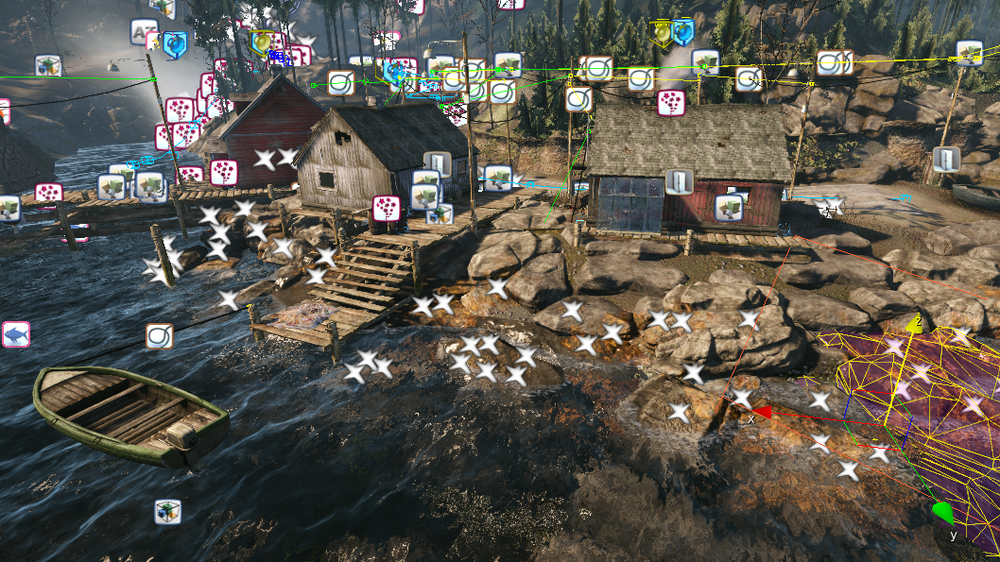
  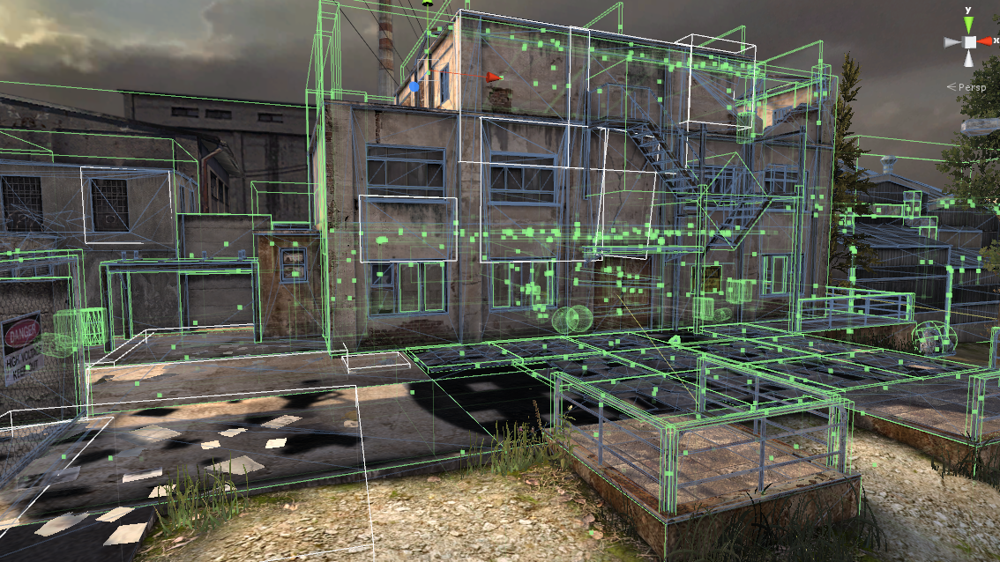
</p>

> <b>Figure 2.1:</b> Screenshots from Cry Engine 3 (left) and Unity (right), showing various game objects distributed in a level.</p>

Traditionally, object systems within games have relied on inheritance hierarchies to share functionality between entities. However, as hierarchies grow they get harder to design, and redesign [\[8\]](#b_8).

Consider a class hierarchy as seen in [Figure 2.2](#fig_2_2) which corresponds to a hypothetical fantasy themed game. Problem would arise if a new feature calls for Collectables or Projectiles to be animated as the logic necessary is not part of either class. One solution is to move the needed functionality higher up in the hierarchy and merge Animated with Drawable. However, this requires changing the hierarchy and merging two unrelated classes, which lowers the design quality of cohesion (a measure of how closely related data and methods of a class are to each other) [\[16\]](#b_16), as they try to be all things to all objects. This usually makes the class harder to maintain, modify and understand.

<p id="fig_2_2" align="center">
  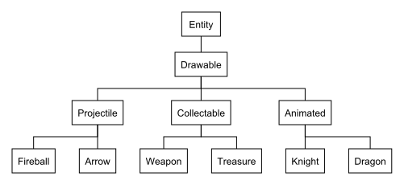
</p>

> <b>Figure 2.2:</b> Traditional class inheritance tree of entities.</p>


### Component-Based Object Systems

An often time better solution when designing object systems is to have a system where exiting functionality can be combined into new objects, and new functionality can be added to existing objects without the need to refactor code and change the inheritance tree.

An attempt to accomplish this is to view each game object as an aggregation of modules or subobjects (usually referred to as components), which provides the entities with access to unique data or functionality. In order to keep this as flexible as possible, the entities needs to be completely generic, with unique functionality provided by modular components. Depending on the kind of object to create, different combinations of components is added to the entity.

A simplified component-based design somewhat inspired by our previous example is illustrated in [Figure 2.3](#fig_2_3).

<p id="fig_2_3" align="center">
  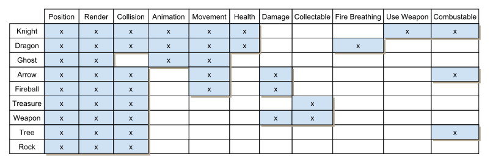
</p>

> <b>Figure 2.3:</b> Hypothetical relationship table among components (top) and entities (left).</p>

In comparison to [Figure 2.2](#fig_2_2) attributes related to Knights and Dragons previously (and implicitly) contained within each class, such as Fire Breathing and Ignitable, has been made into generic components which can be attached to any game objects. Components can be both game-play related, such as Health (which keeps track of health, and allows objects to be damaged and destroyed) and Flying (which modifies movement to allow flying), or subsystem related such as Render (which allows access by the render subsystem to the game objects). The name of an entity is purely nominal and one entity could easily be extended or changed into another, e.g. a fire breathing human or an animated tree swaying in the wind.

Because of its position as the central interface between all other components, the design and implementation of the object system can have a strong impact on all other system components. It also impacts the flexibility at which game designer can make changes to the game.

### Container Data Structures

A wide variety of container type data structures is generally employed by programmers to solve the given task at hand. The details of each container varies greatly, but all have the task of managing one or more elements.

Some of the most commonly used containers [\[1\]](#b_1) are listed as follows:

- **Static Array**: A collection of elements stored contiguously in memory and accessible by an index. Its length is usually statically defined at compile time and do not allow new elements to be added or removed.

- **Dynamic Array**: An array whose length can change dynamically as new elements are added. However, doing so requires allocating and transferring the elements to a new memory block which can be costly and will also invalidate any potential references pointing directly to the old memory location of elements.

- **Linked List**: A collection of elements not stored continuously in memory but linked to one another via pointers.

- **Stack**: A container of elements where elements are added or removed on a last-in-first-out basis often referred to as LIFO.

- **Associative Array**: A collection of key-value pairs. Each stored element have an associated key which can be used to access the stored element.

### Memory Allocators

Most game engines make use of custom allocators to manage memory [\[1\]](#b_1). The principal reason for this is to increase runtime performance, but sometimes also to reduce memory consumption.

Dynamic memory allocation via malloc() or C++’s global operator new, usually referred to as the a heap allocation, are designed for general-purpose allocations [\[17\]](#b_17). They have to handle allocation of memory blocks of mixed sizes. They have to accommodate allocation patterns ranging from long-lived objects existing during the full duration of the program, to large number of temporarily short-lived objects. It also has to deal with memory fragmentation, where free memory becomes locked up in a large number of non-contiguous blocks which otherwise makes the free memory unusable for most sceneries.

By making assumption about the applications memory usage, a custom allocator can often outperform the default allocator. Some caveats however is that custom allocators may sometimes ignore details such as portability, alignment consideration and thread safety [\[17\]](#b_17).

Custom memory allocation in C++ can be handled in a number of ways. The global new operator can be overridden. However, this limits the allocator to use the same allocation strategy on all allocations. Instead the new operator can also be overridden on a per-class basis, which allows the allocator can make assumptions about the size the object, such as in the case of a pool allocator. Finally, in the case of STL-containers, memory allocation is handled using a specific allocator object, which can be specified as a template parameter of the container.

### Memory Optimizations

The CPU cache is important in any memory optimizations as almost all memory used by the application flows through the cache. A cache is a special memory that can be read and written to by the CPU at a much faster rate than the main RAM. When an application accesses a piece of memory it first checks if the data is already in the cache. If the data is in the cache, a “cache hit” occurs, and the data can be loaded into CPU registers without touching the RAM. If the data do not exist, a “cache miss” occurs, and a small piece of memory called a “cache line” is copied to the cache. This can have a large effect on performance, especially on consoles, such as the PS3 fetching memory directly from RAM can have an access time on more than 500 cycles [\[13\]](#b_13). A cache line is generally larger than the requested memory, as the extra memory is expected to be accessed shortly.

### Memory Locality

Since all memory has to move between the RAM and cache eventually, cache misses cannot be avoided. But the data can be rearranged in memory to reduce the number of cache misses. These memory access patterns are generally decided into what is called temporal locality and spatial locality [\[18\]](#b_18)[\[19\]](#b_19).

- **Spatial Locality**: Memory locations near each other tend to be used together. Because of this, when a cache miss occurs, a full cache line is fetched. This improves performance as one big memory transaction is faster than many small transactions. Maximum spatial locality can be achieved by storing data contiguously in memory, such as arranging our data inside an array, an then accessing it sequentially. This reduces the number of cache misses as it allows a maximum number of neighbouring elements to be loaded into the same cache line.

- **Temporal Locality**: Some memory tend to be accessed repeatedly. Because of this recently used memory is kept in the cache. To improve temporal locality, small pieces of data should be reused as much as possible in order to keep the data it in the cache.

### Instruction Cache

A CPU caches instructions as well as data. On most CPUs these are separated in what is often referred to as an I-cache (instruction cache) and a D-cache (data cache). As the two caches is often physically separate, a program can run slow, both because of an I-cache miss or because of a D-cache miss.

Reducing D-cache misses is the same when improving data locality. The data should be organized in continuous blocks that are as small as possible, and then accessed sequentially. When the data is small it is more likely to fit in the cache line, and when the data is accessed sequentially, the CPU never has to reload a cache line from the same region of RAM [\[1\]](#b_1).

The performance of the I-cache is decided by the memory layout of the code, which is often dictated by the compiler. However, depending on the compiler, I-cache misses can be reduced by keeping high-performance code as small as possible in terms of machine language instructions, avoiding calling functions from within performance-critical sections of code and through judicious use of inline functions.

### Data Hazards

Data hazards are problems with the instruction pipeline of a CPU architecture that leads to reduced performance, or in worse case incorrect computation result. The pipeline generally consists of several stages. In optimal situations each instruction and each stage of the pipeline takes 1 cycle to executes. But in some situations an instruction can not execute until a previous instructions is complete.

There are three situations data hazards can occur, all involving writing data:

- **Read After Write (RAW)**: occurs when an instruction refers to the result of an instruction that has not yet exited the pipeline.

- **Write After Read (WAR)**: occurs when an instruction needs to write to a location that is still being read.

- **Write After Write (WAW)**: occurs when an instruction needs to write to a location that another instruction is already writing to.

### Data Alignment

Depending on the architecture, different sized classes and structs generally have an alignment requirement which must be respected to allow the CPU to read and write to the memory effectively. E.g. in a 32-bit architecture the data may be aligned if the data is stored in 4 consecutive bytes (4*8=32) and if the first byte lies on a 4 byte boundary. For small structures, e.g. a Booleans, the structure needs to be padded by the compiler to allow optimal performance, but at the cost of extra memory. Alternatively the padding can sometimes be omitted by packing the structure and reducing memory usage, but may lead to slower access.

## Method

The performance of each data structures is measured using 3 different benchmarks, each designed to measures how execution time correlates to the number of elements with regards to operations typically used in a game simulation. The elapsed time is measured using a high precision timer. A brief description of each benchmark is as follows:

- Allocation: The average time to create varying number of elements. The elements to be put inside the array is calculated in advance. Only the time of adding the precalculated is measured.

- Deallocation: The average time to remove varying number of elements.

- Iteration speed: The average time to read a small amount of data from varying number of elements. This data is then used to compute a checksum to make sure that all elements has been read properly. The read data is needed to give accurate readings on performance as most compilers optimizing away unused code and variables.

## Implementations

This section covers the implementations of the custom data structures used in the experiment.

Each custom data structure has been collected under a library referred to as AberrantUtils and made available available on GitHub. The source source code for each implementation can be viewed at the readers own discretion from the following link: <https://github.com/Adelost/AberrantUtils/>

### C++ Standard Library

Apart from the custom data structures, the following data structures from the C++ Standard Library are used for comparison:

- **std::vector:** A dynamic array.

- **std::list:** A linked list.

- **std::unordered\_map:** An associative array.

- **std::map:** An associative array which keeps keys sorted alphabetically.

### Custom Data Structures

#### ae::Array

The Array container is a custom dynamic array implementation to compare against std::vector.

<p id="fig_4_1" align="center">
  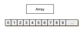
</p>

> <b>Figure 4.1:</b> An array of elements laid out in memory.</p>

<p id="fig_4_2" align="center">
  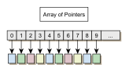
</p>

> <b>Figure 4.2:</b>  An array of pointers (pointing to elements) laid out in memory. Each shifting color represents an individual memory segment.</p>

#### ae::StationaryArray

A data structure similar to a dynamic-array, but which does not reallocate the memory address of the stored elements when growing. However, elements are not guaranteed to be stored in adjacent memory locations.

Elements are allocated in memory segments which doubles in size for each added segment. This makes the data structure cache oblivious as it is designed to work for all types of cache sizes. The likelihood of cache misses is increased in the smaller segments, but as more elements are added to the data structures, this overhead often becomes negligible.


<p id="fig_4_3" align="center">
  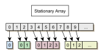
</p>

> <b>Figure 4.3:</b> A Stationary Array laid out in memory. Each color represents an individual memory segment.</p>

**Pros**

- Fast.

- No reallocation of objects.

**Cons**

- Not as fast as arrays.

- Memory address of elements cannot be used to calculate index.

#### ae::PoolArray

A data structure inspired by a pool allocator, that picks lower indexes first when reusing empty slots (compared to the linked list approach by a pool allocator). As large numbers of allocations and deallocations are likely to be done consecutively inside a game, new elements will end up next to each other in memory, which may improves data locality and reduces memory fragmentation.

<p id="fig_4_4" align="center">
  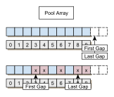
</p>

> <b>Figure 4.4:</b> A Pool Array laid out in memory with no deleted elements (top) and 5 deleted elements (bottom). The top array denotes deleted elements (gaps) and the bottom array contains elements.</p>

**Usage**

Allocating a single element with a PoolPtr:

``` c++
PoolPtr<int> p = 42;

assert(*p == 42);

p.release();
```

Allocating multiple elements with a PoolPtr and Array:

``` c++
Array<PoolPtr<int>> a;
a << 0 << 1 << 2 << 3 << 4;

int total = 0;
for (PoolPtr<int> i : a) {
    total += *i;
}

assert(total == 10);

for (PoolPtr<int> i : a) {
    i.release();
}
```

#### ae::PoolPtr

A PoolPtr is a template based custom allocator wrapper. It can be used to improve performance when allocating almost any object. This requires an object to be instantiated with the PoolPtr and the object can then be accessed from the PoolPtr similarly to an ordinary pointer or a smart pointer. This also requires the allocated object to be released from the PoolPtr before existing the application, similarly to deleting a pointer.

The PoolPtr works by simply wrapping an index to a StablePoolArray. The object is then allocated using the StablePoolArray as a memory allocator.

The pool allocator can be used in conjunction with a data structure to behave in the same way as if the data structure contained pointers to elements.

**Usage**

Allocating a single element with a PoolPtr:

``` c++
PoolPtr<int> p = 42;

assert(*p == 42);

p.release();
```

Allocating multiple elements with a PoolPtr and Array:

``` c++
Array<PoolPtr<int>> a;
a << 0 << 1 << 2 << 3 << 4;

int total = 0;
for (PoolPtr<int> i : a) {
    total += *i;
}

assert(total == 10);

for (PoolPtr<int> i : a) {
    i.release();
}
```

#### ae::IdPoolArray

A wrapped PoolArray that associates each element with an id. Suitable for a component-centric architecture where the id corresponds to an entity.

**Usage**

Allocating multiple elements to a IdPoolArray.

``` c++
IdPoolArray<int> a;

assert(a[0] == nullptr);

a.add(0, 0);

assert(a[0]);
assert(*a[0] == 0);

a.add(0, 1);
a.add(1, 1);
a.add(2, 2);

assert(*a[0] == 1);
assert(*a[2] == 2);

a.count();
```

Iterating all elements inside a IdPoolArray:

``` c++
a.add(0, 1);
a.add(1, 2);
a.add(2, 3);

int total = 0;

for (auto i : a) {
    total += *i;
}

assert(total == 6);
```

#### ae::PoolList

A mix between a linked list and a pool allocator. The pool allocator should make it faster to add and remove elements than in a ordinary linked list.

Linked lists are optimized for random insertion and deletion since, since memory does not have to be consecutive. 

One suggested use case for a linked list inside an ECS could be to keep track of individual compontents assigned to each entity, or similar statistics that would be hard to keep track of if all components are spread in a Property-Centric manner.

### Note on Thread Safety

Some of the custom data structures  make use static variables when allocating memory. This is generally not thread safe. Multithreading is out of scope in this study, but if needed this can probably be fixed with the C++ keyword `thread_local` that allows each thread to have its own copy of the variable.

## Hardware

The benchmark is measured on the following hardware:

* **CPU:** Intel Core 2 Q6600 CPU (8M Cache, 2.40 GHz)
* **RAM:** 8 GB
* **Operating System:** Windows 8

## Results

<p id="fig_5_1" align="center">
  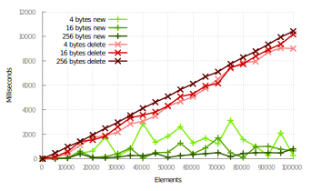
</p>

> <b>Figure 5.1:</b> Heap allocation (new) and deallocation (delete) with varying numbers and sizes of elements.</p>

<p id="fig_5_2" align="center">
  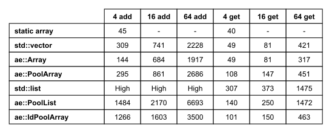
</p>

> <b>Figure 5.2:</b> Time in milliseconds to add (add) and retrieve (get) a large number of elements of varying sizes (x bytes) from different containters.</p>


## Conclusions

Allocating and deleting elements using C++’s standard heap allocator had a large impact on performance with deletion of elements being by far slowest with deleting 100,000 object taking up to 10 seconds. Elements of different sizes had no notable impact on performance, and in the case of allocating, actually worsened performance on average.

Compared to the standard heap allocator all proposed data structures except `std::list` was vastly superior when adding elements. 

- **std::array** is the standard library implementation of a resizable array, and is used as a baseline that other data structures can be compared against. By comparing it to a static array that does not require any allocation, it can be deduced that about 50 ms is spent writing to the data structure, and 250 ms resizing/allocating memory.

- **ae::Array** performed slightly better than `std::vector` especially when adding 4 bytes elements. It also performed slighly better when accessing 64 bytes elements. One possible explanation might the that `ae::Array` has a growth factory of 2, whereas the growth factor of `std::vector` varies between implementations but most make use of 1.5. This might result in `ae::Array` having a more optimized [data alignment](#data-alignment) compared to `std::vector`.
  
- **ae::PoolArray** performed very similar to `std::vector` when adding. Slightly worse during access, especially at 4 bytes, though in practice the cost might be negligible compared to any calculation that should be made with the data.

- **std::list** is the standard library implementation of a linked list. Overhead was very high when adding elements. Many times higher than all other data structure. Access time is about 3-6 times higher than `std::vector`. Though in practice this might still be acceptable.

- **std::PoolList** provide drastically improved performance compared to `std::list` when adding, and slightly improved performance during access.

- **ae::IdPoolArray** performed 4 times slower than `std::vector` when adding, though depending on the use case this might be negligable. Access time is on pair with ``ae::PoolArray``.


## Future Work

* A benchmark comparing randomly accessed attributes to sequential attributes is not included in this study and would be of high interest to investigate further. This could further be compared to a property-centric vs an object-centric ECS.

* The benchmark was measured only on PC. It would be of interest to repeat the measurement on limited hardware with a slower cache memory than an average PC, such as PS3 or Raspberry Pi.

* Only single threading was accounted for. Additional optimizations such as multithreading or SIMD could have a large effect on performance.

* Additional options of the C++ language could be investigated, e.g. modifying data structures with "alloca" which can improve performance by allocating memory on the stack stack frame instead of heap, or features new to C++ 11 such as thread_local.


## Bibliography

- <div id="b_1">[1] J. Gregory, Game engine architecture. Wellesley, Mass: A K Peters, 2009, ch. Engine Support Systems, Runtime Gameplay Foundation Systems, pp. 197–259, 711–817.</div>
- <div id="b_2">[2] M. Doherty, A Software Architecture for Games. University of the Pacific Depratment of Computer Science Research and Project Journal, 2003.</div>
- <div id="b_3">[3] S. Bilas, “A data-driven game object system,” in Game Developers Confer- ence Proceedings, 2002.</div>
- <div id="b_4">[4] D. Eberly, 3D game engine architecture : engineering real-time applications with Wild Magic. Amsterdam Boston: Morgan Kaufman Publishers, 2005, ch. The Object System, pp. 105–148.</div>
- <div id="b_5">[5] M. Chady, “Theory and practice of game object component architecture,” in Game Developers Conference Proceedings, 2009.</div>
- <div id="b_6">[6] D. Church, “Object systems: Methods for attaching data to objects and connecting behavior,” in Game Developers Conference Proceedings, 2002.</div>
- <div id="b_7">[7] M. Harmon, “A system for managing game entities,” in Game programming gems 4, A. Kirmse, Ed. Hingham, Mass: Charles River Media, 2004.</div>
- <div id="b_8">[8] B. Rene, “Component based object management,” in Game programming gems 5, K. Pallister, Ed. Hingham, Mass: Charles River Media, 2005.</div>
- <div id="b_9">[9] C. Stoy, “Game object component system,” in Game programming gems 6, M. Dickheiser, Ed. Boston, Mass: Charles River Media, 2006.</div>
- <div id="b_10">[10] A. Duran, “Building object systems: Features, trade offs, and pitfalls,” in Game Developers Conference Proceedings, 2003.</div>
- <div id="b_11">[11] L. V. Magnusson, “Game mechanics engine,” Master’s thesis, Østfold University College, 2011.</div>
- <div id="b_12">[12] E. Freeman, Head First design patterns. Sebastopol, CA: O’Reilly, 2004.</div>
- <div id="b_13">[13] N. Llopis, “High-performance programming with data-oriented design,” in Game Engine Gems 2, E. Lengyel, Ed. Wellesley, Mass: A K Peters, 2011.</div>
- <div id="b_14">[14] J. M. Chang, W. H. Lee, and W. Srisa-an, “A study of the allocation behavior of c++ programs,” vol. 57, no. 2, 2001, pp. 107–118.</div>
- <div id="b_15">[15] S. Bilas, “The continuous world of dungeon siege,” in Game Developers Conference Proceedings, 2003.</div>
- <div id="b_16">[16] R. Martin, Clean Code: A Handbook of Agile Software Craftsmanship. Prentice Hall, 2008, pp. 135-152.</div>
- <div id="b_17">[17] S. Meyers, Effective C++: 55 Specific Ways to Improve Your Programs and Designs (3rd Edition). Addison-Wesley Professional, 2005, ch. Customizing new and delete.</div>
- <div id="b_18">[18] T. Akenine-Moller, E. Haines, and N. Hoffman, Real-Time Rendering, Third Edition. A K Peters/CRC Press, 2008, ch. Optimization, pp. 703–707.</div>
- <div id="b_19">[19] R. Gerber, Software Optimization Cookbook: High-Performance Recipes for the Intel Architecture. Intel Pr, 2002, ch. Memory, pp. 89–116.</div>

## Internet Links

- <div id="l_1"><sup>1</sup> http://t-machine.org/index.php/2007/09/03/entity-systems-are-the-future-of-mmog-development-part-1/, accessed 2014-02-15</div>
- <div id="l_2"><sup>2</sup> http://cowboyprogramming.com/2007/01/05/evolve-your-heirachy/, accessed 2014-02-15</div>
- <div id="l_3"><sup>3</sup> http://unity3d.com/, accessed 2014-02-15</div>
- <div id="l_4"><sup>4</sup> http://t-machine.org/index.php/2007/09/03/entity-systems-are-the-future-of-mmog-development-part-1/, accessed 2014-05-15</div>
- <div id="l_5"><sup>5</sup> http://www.cplusplus.com/reference/vector/vector/reserve/, accessed 2014-02-15</div>
- <div id="l_6"><sup>6</sup> http://www.cryengine.com/, accessed 2014-05-15</div>
- <div id="l_7"><sup>7</sup> http://unity3d.com/, accessed 2014-05-15</div>
- <div id="l_8"><sup>8</sup> https://www.linkedin.com/in/scobi/, accessed 2021-08-29</div>

 
